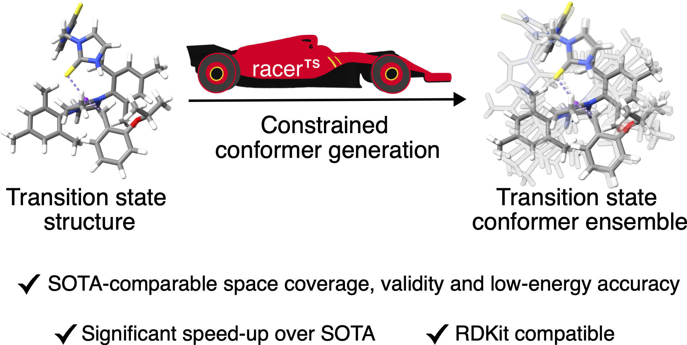

# Getting started

## What is racer<sup>TS</sup>?

racer<sup>TS</sup> generates conformer ensembles for transition states (TS) using RDKit functions. The same pipeline gives ensembles of ground states and of any structure with a part held fixed.

This documentation covers how to install and use racer<sup>TS</sup>, the command-line interface, and how to configure the individual components.

- [Pipelines and tasks](pipeline.md): transition states, ground states, stages,
  ensembles; [settings](settings.md) and [plug-in points](plugins.md)
- [Staged workflow](workflow.md): several levels of theory, saddle points
- [Restraints](restraints.md), [active-bond windows](active-bonds.md) and
  [swaps](swap.md)
- [Command-line interface](cli.md)
- [Modules overview](modules/README.md)




## Installation

- Python 3.10+
- RDKit >= 2023.9.6 (installed automatically via pip dependency)

```bash
pip install racerts
pip install "racerts[ase]"   # optional: refinement with ASE calculators (xTB, MLIPs, ...)
pip install "racerts[xtb]"   # optional: the ASE extra plus tblite, for GFN2-xTB
pip install "racerts[yaml]"  # optional: pipeline settings as YAML files
pip install "racerts[viz]"   # optional: the notebook viewers (py3Dmol, IPython)
```

## Input format

- Input geometry must be an .xyz file of a TS structure (or .sdf/.mol with bonds)
- Reacting atoms are the atoms whose connectivity changes in the reaction
- Overall molecular charge
- Optionally, a SMILES for either product or starting material can be provided to define the topology around the TS


## Quickstart (Python)

```python
import racerts

# ts.xyz (in examples/) is one TS geometry; the reacting atoms are 0-based indices
ensemble = racerts.generate_ts(
    "ts.xyz", reacting_atoms=[7, 8, 22], smiles="C/[NH+]=C(OC)/c1ccccc1.COS(=O)(=O)[O-]"
)
ensemble.write_xyz("ensemble.xyz")
print(ensemble.summary())
```

`generate_ts` returns a [`ConformerEnsemble`](pipeline.md#conformer-ensembles): the RDKit
molecule with its conformers (`ensemble.mol`), their energies and provenance. Settings
are passed as a [`PipelineConfig`](settings.md); tasks other than transition
states (ground states, constrained cores) are described in [Pipelines and
tasks](pipeline.md).

The legacy racerts API still works and gives the ensembles of legacy racerts (as does
`config=racerts.PipelineConfig.legacy()`):

```python
from racerts import ConformerGenerator

cg = ConformerGenerator()
mol = cg.generate_conformers(file_name="ts.xyz", charge=0, reacting_atoms=[7, 8, 22])
cg.write_xyz("ensemble.xyz")
```

## Quickstart (CLI)

```bash
racerts ts ts.xyz --reacting-atoms 7 8 22 --smiles "C/[NH+]=C(OC)/c1ccccc1.COS(=O)(=O)[O-]"
racerts ts.xyz --charge 0 --reacting_atoms 7 8 22   # legacy racerts form and settings (as racerts ts --legacy)
```

This will generate a pruned ensemble and write `conformer_ensemble.xyz` in the current directory by default.

Messages go through Python's `logging` (logger `racerts`): warnings are shown by
default; `verbose=True` (or `-v`, `-vv` on the command line) also shows progress.
